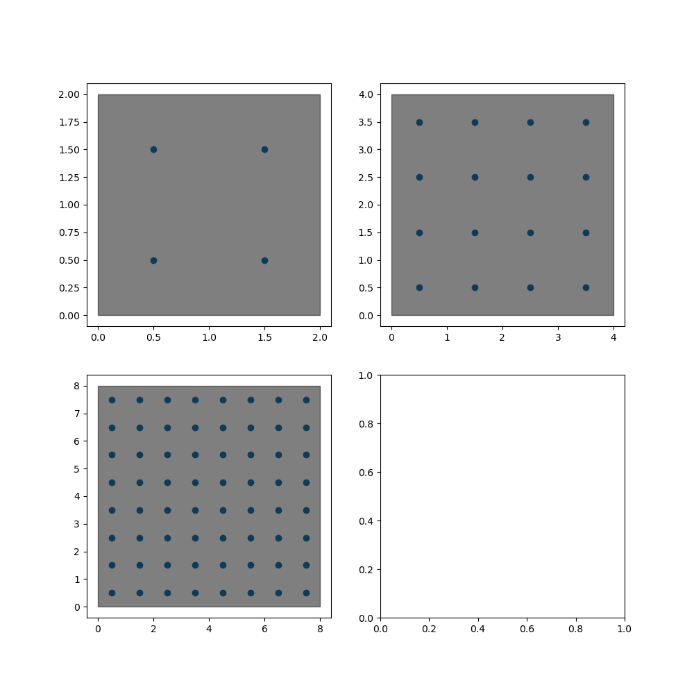
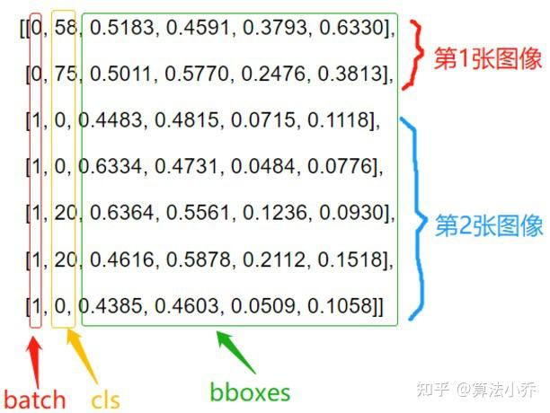
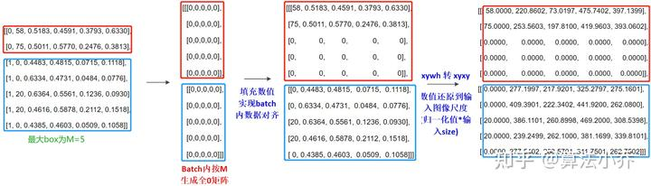
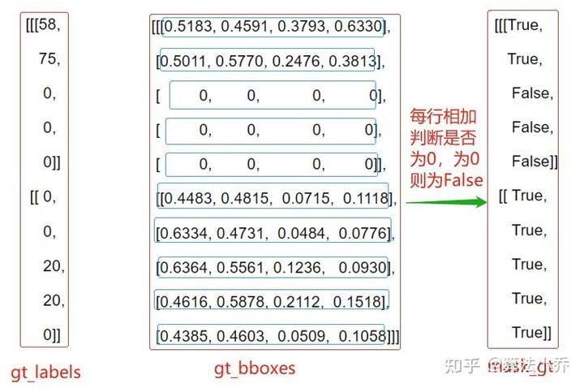
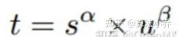

# YOLOV8-Code-Learning
**学习YOLOv8正负样本如何分配**

## Usage
`
python LabelAssigner.py 
`</br>
运行改代码可以看到完整的输出，输出会保存在run.log中

## 具体过程
### 输入
#### 输入有两个，一个是YOLOV8 NECK的三层输出
```python
inputs = [torch.randn(4, 67, 8, 8),
              torch.randn(4, 67, 4, 4),
              torch.randn(4, 67, 2, 2)
              ]  # b=4
```
- 这里假设是做三类分类任务，所以输出通道为64+3
- 一般来讲特征图大小在输入图像大小为640的情况下应该为80, 40, 20, 这里为了查看输出结果，改为8, 4, 2, 因此总输出的预测框从原始的8400变为8 * 8 + 4 * 4 + 2 * 2 = 84
- 假设batch = 4

#### 另一个输入是标注框
```python
labels = torch.tensor(np.array([[0, 1.0, 0.612, 0.334, 0.666, 0.378],
                                    [0, 0.0, 0.553, 0.054, 0.426, 0.109],
                                    [1, 1.0, 0.457, 0.324, 0.747, 0.359],
                                    [2, 2.0, 0.875 , 0.484, 0.25, 0.315],
                                    [2, 1.0, 0.45, 0.36, 0.72, 0.411],
                                    [2, 0.0, 0.27, 0.064, 0.46, 0.12],
                                    [3, 2.0, 0.348, 0.521, 0.151, 0.237]]), dtype=torch.float32)
```
- 该标注框是YOLO的标准输入格式，为(n ,6)的矩阵。分别代表该图片在该batch中的索引、类别、归一化中心点x坐标、归一化中心点y坐标、归一化宽、归一化高。给出的labels来自实际任务，为人体的标注框。

### 整体目的
在了解输入后，应该明白整个正负样本分配的目的。在此之前，需要知道网络模型的预测输出大小，输出同样有两个，一个为预测分数pred_scores，shape为(b, anchor_num=84, cls_num=3); 另一个为预测坐标pred_bboxes，shape为(b, anchor_num=84, 4), 而*整个正负样本分配的目的就是将labels变化成同上述矩阵相同的大小*，即最后输出target_scores的shape为(b, anchor_num=84, cls_num=3)， target_bboxes为(b, anchor_num=84, 4)，*完成为每一个anchor给予标签的作用。*

### 整体流程概览
整体流程可以简单分为三步
- 预测结果预处理：pred_process()， make_anchors()，decode()
- 标注结果预处理: ann_process
- 正负样本分配: TaskAlignedAssigner()

#### 1. 预测结果预处理
注意：下述注释中的8400等同于84, stride大小[8, 16, 32]等同于[80, 160, 320]
这里我懒得修改注释了
##### i. 预测结果整合
```python
def pred_process(self, inputs):
    '''     
    L = class_num + 4 * self.reg_max = class_num + 64
    多尺度结果(b, L, 80, 80), (b, L, 40, 40), (b, L, 20, 20)整合到一起为 (b, 8400, L) 
    按照cls 与 box 拆分为 (b, 8400, 2), (b, 8400, 64)
    '''
    predictions = [] # 记录每个尺度的转换结果 
    strides = [] # 记录每个尺度的缩放倍数
    for input in inputs:
        self.bs, cs, in_h, in_w = input.shape 
        # 计算该尺度特征图相对于网络输入的缩放倍数
        stride = self.input_h // in_h 
        strides.append(stride)
        # shape 转换 如 (b, 80, 80, 64+cls_num) -> (b, 6400, 64+cls_num)
        prediction = input.view(self.bs, 4 * self.reg_max + self.class_num, -1).permute(0, 2, 1).contiguous()
        predictions.append(prediction)
    # (b, 6400+1600+400, cls_num+64) = (b, 8400, 64+cls_num) = (b, 8400, 67)
    predictions = torch.cat(predictions, dim=1)
    # 按照cls 与 reg 进行拆分
    # (b, 8400, cls_num) = (b, 8400, 3)
    pred_scores = predictions[..., 4 * self.reg_max:]
    # (b, 8400, 64)
    pred_regs = predictions[..., :4 * self.reg_max]
    return pred_scores, pred_regs, strides 
```
- 预测结果分数 pred_scores.shape (b, 8400, 3)
- 预测的回归分布(需要通过解码转换到标准的4维输出上) pred_regs.shape (b, 8400, 16 * 4)
- 每个特征图的下采样倍率，后续用来恢复每个特征图的输出结果到原图尺度上 strides: [8, 16, 32]

##### ii. anchors锚点
```python
def make_anchors(self, strides, grid_cell_offset=0.5):
    '''
    各特征图每个像素点一个锚点即Anchors, 即每个像素点只预测一个box
    故共有 80x80 + 40x40 + 20x20 = 8400个anchors
    '''
    # anc_points : (8400, 2) ，每个像素中心点坐标
    # strides_tensor: (8400, 1) ，每个像素的缩放倍数
    anc_points, strides_tensor = [], []
    for i , stride in enumerate(strides):
        in_h = self.input_h // stride 
        in_w = self.input_w // stride 
        
        # anchor坐标取特征图每个特征点的中心点
        sx = torch.arange(0, in_w).type(torch.float32) + grid_cell_offset
        sy = torch.arange(0, in_h).type(torch.float32) + grid_cell_offset
        # (in_h, in_w) 
        grid_y, grid_x = torch.meshgrid(sy, sx)
        # (in_h, in_w, 2) -> (N, 2)
        anc_points.append(torch.stack((grid_x, grid_y), -1).view(-1, 2).type(torch.float32))
        strides_tensor.append(torch.full((in_h * in_w, 1), stride).type(torch.float32))
    
    return torch.cat(anc_points, dim=0), torch.cat(strides_tensor, dim=0)
```
- anc_points : (8400, 2) ，每个像素中心点坐标
```python
tensor([[0.5000, 0.5000],
        [1.5000, 0.5000],
        [2.5000, 0.5000],
        [3.5000, 0.5000],
        [4.5000, 0.5000],
        [5.5000, 0.5000],
        [6.5000, 0.5000],
        [7.5000, 0.5000],
        [0.5000, 1.5000],
        [1.5000, 1.5000],
        [2.5000, 1.5000],
        [3.5000, 1.5000],
        [4.5000, 1.5000],
        [5.5000, 1.5000],
        [6.5000, 1.5000],
        [7.5000, 1.5000],
        [0.5000, 2.5000],
        [1.5000, 2.5000],
        [2.5000, 2.5000],
        [3.5000, 2.5000],
        [4.5000, 2.5000],
        [5.5000, 2.5000],
        [6.5000, 2.5000],
        [7.5000, 2.5000],
        [0.5000, 3.5000],
        [1.5000, 3.5000],
        [2.5000, 3.5000],
        [3.5000, 3.5000],
        [4.5000, 3.5000],
        [5.5000, 3.5000],
        [6.5000, 3.5000],
        [7.5000, 3.5000],
        [0.5000, 4.5000],
        [1.5000, 4.5000],
        [2.5000, 4.5000],
        [3.5000, 4.5000],
        [4.5000, 4.5000],
        [5.5000, 4.5000],
        [6.5000, 4.5000],
        [7.5000, 4.5000],
        [0.5000, 5.5000],
        [1.5000, 5.5000],
        [2.5000, 5.5000],
        [3.5000, 5.5000],
        [4.5000, 5.5000],
        [5.5000, 5.5000],
        [6.5000, 5.5000],
        [7.5000, 5.5000],
        [0.5000, 6.5000],
        [1.5000, 6.5000],
        [2.5000, 6.5000],
        [3.5000, 6.5000],
        [4.5000, 6.5000],
        [5.5000, 6.5000],
        [6.5000, 6.5000],
        [7.5000, 6.5000],
        [0.5000, 7.5000],
        [1.5000, 7.5000],
        [2.5000, 7.5000],
        [3.5000, 7.5000],
        [4.5000, 7.5000],
        [5.5000, 7.5000],
        [6.5000, 7.5000],
        [7.5000, 7.5000],
        [0.5000, 0.5000],
        [1.5000, 0.5000],
        [2.5000, 0.5000],
        [3.5000, 0.5000],
        [0.5000, 1.5000],
        [1.5000, 1.5000],
        [2.5000, 1.5000],
        [3.5000, 1.5000],
        [0.5000, 2.5000],
        [1.5000, 2.5000],
        [2.5000, 2.5000],
        [3.5000, 2.5000],
        [0.5000, 3.5000],
        [1.5000, 3.5000],
        [2.5000, 3.5000],
        [3.5000, 3.5000],
        [0.5000, 0.5000],
        [1.5000, 0.5000],
        [0.5000, 1.5000],
        [1.5000, 1.5000]])
```
可视化上述坐标点在三个尺度的特征图上


- strides_tensor: (8400, 1) ，每个像素的缩放倍数
```python
tensor([[ 80.],
        [ 80.],
        [ 80.],
        [ 80.],
        [ 80.],
        [ 80.],
        [ 80.],
        [ 80.],
        [ 80.],
        [ 80.],
        [ 80.],
        [ 80.],
        [ 80.],
        [ 80.],
        [ 80.],
        [ 80.],
        [ 80.],
        [ 80.],
        [ 80.],
        [ 80.],
        [ 80.],
        [ 80.],
        [ 80.],
        [ 80.],
        [ 80.],
        [ 80.],
        [ 80.],
        [ 80.],
        [ 80.],
        [ 80.],
        [ 80.],
        [ 80.],
        [ 80.],
        [ 80.],
        [ 80.],
        [ 80.],
        [ 80.],
        [ 80.],
        [ 80.],
        [ 80.],
        [ 80.],
        [ 80.],
        [ 80.],
        [ 80.],
        [ 80.],
        [ 80.],
        [ 80.],
        [ 80.],
        [ 80.],
        [ 80.],
        [ 80.],
        [ 80.],
        [ 80.],
        [ 80.],
        [ 80.],
        [ 80.],
        [ 80.],
        [ 80.],
        [ 80.],
        [ 80.],
        [ 80.],
        [ 80.],
        [ 80.],
        [ 80.],
        [160.],
        [160.],
        [160.],
        [160.],
        [160.],
        [160.],
        [160.],
        [160.],
        [160.],
        [160.],
        [160.],
        [160.],
        [160.],
        [160.],
        [160.],
        [160.],
        [320.],
        [320.],
        [320.],
        [320.]])
```

##### iii. 解码预测回归分布
```python
def decode(self, pred_regs):
    '''
        预测结果解码
        1. 对bbox预测回归的分布进行积分
        2. 结合anc_points，得到所有8400个像素点的预测结果
    '''
    if self.use_dfl:
        b, a, c = pred_regs.shape # (b, 8400, 64) 
        # 分布通过 softmax 进行离散化处理
        # (b, 8400, 64) -> (b, 8400, 4, 16) -> softmax处理 
        # l, t, r, b其中每个坐标值对应16个位置(0-15)的概率值
        # 概率表示每个位置对于最终坐标值的重要程度 
        pred_regs = pred_regs.view(b, a, 4, c//4).softmax(3)
        # 积分，相当于对16个分布值进行加权求和，最终的结果是所有位置的加权求和
        # (b, 8400, 4)
        pred_regs = pred_regs.matmul(self.proj.type(torch.float32))

    # 此时的regs, shape-> bx8400x4,其中4表示 anc_point中心点分别距离预测box的左上边与右下边的距离
    lt = pred_regs[..., :2]
    rb = pred_regs[..., 2:]
    # xmin ymin 
    x1y1 = self.anc_points - lt 
    # xmax ymax
    x2y2 = self.anc_points + rb 
    # (b, 8400, 4)        
    pred_bboxes = torch.cat([x1y1, x2y2], dim=-1)
    return pred_bboxes
```
- 预测坐标位置，首先通过对16个分布值加权求和，得到的4个坐标值*表示anc_point中心点分别距离预测box的左上边(lt)与右下边(rb)的距离*, 然后转换为xmin, ymin, xmax, ymax的形式，方便后续的ciou的计算pred_bboxes.shape (b, 8400, 4), *这里可以看到预测结果实际是个相对值， 且此时的4个值都在特征值尺度下*。 

#### 2. 标注结果预处理
```python
def ann_process(self, annotations):
    '''
        batch内不同图像标注box个数可能不同，故进行对齐处理
        1. 按照batch内的最大box数目M,新建全0tensor
        2. 然后将实际标注数据填充与前面，如后面为0，则说明不足M，用0补齐
    '''
    # 获取batch内每张图像标注box的bacth_idx
    batch_idx = annotations[:, 0]
    # 计算每张图像中标注框的个数
    # 原理对tensor内相同值进行汇总
    _, counts = batch_idx.unique(return_counts=True)
    counts = counts.type(torch.int32)
    # 按照batch内最大M个GT创新全0的tensor (b, M, 5), 其中5 = (cls, cx, cy, width, height)
    res = torch.zeros(self.bs, counts.max(), 5).type(torch.float32)
    for j in range(self.bs):
        matches = batch_idx == j 
        n = matches.sum()
        if n: 
            res[j, :n] = annotations[matches, 1:]
    # res 为归一化之后的结果, 需通过scales映射回输入尺度
    scales = [self.input_w, self.input_h, self.input_w, self.input_h]
    scales = torch.tensor(scales).type(torch.float32)
    res[..., 1:5] = xywh2xyxy(res[..., 1:5]).mul_(scales)
    # gt_labels (b, M, 1)
    # gt_bboxes （b, M, 4）
    gt_labels, gt_bboxes = res[..., :1], res[..., 1:]
    # gt_mask (b, M, 1)
    # 通过对四个坐标值相加，如果为0，则说明该gt信息为填充信息，在mask中为False，
    # 后期计算过程中会进行过滤
    gt_mask = gt_bboxes.sum(2, keepdim=True).gt_(0)
    return gt_bboxes, gt_labels, gt_mask

```
整个过程可以图解如下：</br>
(原图来自[https://zhuanlan.zhihu.com/p/633094573](https://zhuanlan.zhihu.com/p/633094573)）</br>
</br>
这里以batch=2举例，类别数为80。第一张图片有2个目标，第二张图片有5个目标

</br>
输出结果</br>

- 标注框坐标 gt_bboxes.shape (b, M, 4), 注意这里已经是原图尺度了
```python
tensor([[[ 1.7856e+02,  9.2800e+01,  6.0480e+02,  3.3472e+02],
         [ 2.1760e+02, -3.2000e-01,  4.9024e+02,  6.9440e+01],
         [ 0.0000e+00,  0.0000e+00,  0.0000e+00,  0.0000e+00]],

        [[ 5.3440e+01,  9.2480e+01,  5.3152e+02,  3.2224e+02],
         [ 0.0000e+00,  0.0000e+00,  0.0000e+00,  0.0000e+00],
         [ 0.0000e+00,  0.0000e+00,  0.0000e+00,  0.0000e+00]],

        [[ 4.8000e+02,  2.0896e+02,  6.4000e+02,  4.1056e+02],
         [ 5.7600e+01,  9.8880e+01,  5.1840e+02,  3.6192e+02],
         [ 2.5600e+01,  2.5600e+00,  3.2000e+02,  7.9360e+01]],

        [[ 1.7440e+02,  2.5760e+02,  2.7104e+02,  4.0928e+02],
         [ 0.0000e+00,  0.0000e+00,  0.0000e+00,  0.0000e+00],
         [ 0.0000e+00,  0.0000e+00,  0.0000e+00,  0.0000e+00]]])
```
- 标注框类别 gt_labels.shape (b, M, 1)
```python
tensor([[[1.],
         [0.],
         [0.]],

        [[1.],
         [0.],
         [0.]],

        [[2.],
         [1.],
         [0.]],

        [[2.],
         [0.],
         [0.]]])
```
- 是否为填充的标注框 gt_mask.shape (b, M, 1)
```python
tensor([[[1.],
         [1.],
         [0.]],

        [[1.],
         [0.],
         [0.]],

        [[1.],
         [1.],
         [1.]],

        [[1.],
         [0.],
         [0.]]])
```

#### 3. 正负样本分配
下面进入最重要的部分，正负样本分配。在开始进入流程之前，先来看下我们的输入都有什么。
```python
target_bboxes, target_scores, fg_mask = self.assigner(pred_scores.detach().sigmoid(),
                                                      pred_bboxes.detach() * self.stride_scales,
                                                      self.anc_points * self.stride_scales,
                                                      gt_labels,
                                                      gt_bboxes,
                                                      gt_mask)
```
- pred_scores.detach().sigmoid()： 经过sigmoid处理的网络类别预测分数, shape(b, 8400, 3)
- pred_bboxes.detach() * self.stride_scales: 转换到原始尺度的网络预测框, shape(b, 8400, 4) 
- self.anc_points * self.stride_scales: 转换到原始尺度的网格中心点, shape (8400, 2)
- gt_labels: 标注框类别, shape(b, M, 1)
- gt_bboxes: 标注框坐标, shape(b, M, 4)
- gt_mask: 掩码，判断gt中是否是填充信息, shape(b, M, 1)

##### a. 初步筛选
assigner实际输入是有batch这个维度的，为了方便，实际代码中会对这个batch进行遍历，循环处理每一张图片，因此下面讲解的过程都可认为是对一张图片做的处理, 不需要考虑batch这个维度。</br>
原则：*anchor_points落在gt_boxes内部，作为初步筛选的正样本。*
```python
def __get_in_gts_mask(self,gt_bboxes,anc_points):
    # 找到M个GTBox的左上与右下坐标 M x 1 x 2
    gt_bboxes = gt_bboxes.view(-1,1,4)
    lt,rb = gt_bboxes[...,:2],gt_bboxes[...,2:]
    # anc_points 增加一个维度 1 x 8400 x 2 
    anc_points = anc_points.view(1,-1,2)
    # 差值结果 M x 8400 x 4 
    bbox_detals = torch.cat([anc_points - lt,rb - anc_points],dim=-1)
    # 第三个维度均大于0才说明在gt内部
    # M x 8400
    in_gts_mask = bbox_detals.amin(2).gt_(self.eps)
    return in_gts_mask 
```
这里判断方式很简单，计算M个GT左上坐标和anc_points的距离，以及右下坐标和anc_points的距离，如果最小值都大于0,则说明该anchor_point落在了GT框中。
- in_gts_mask.shape(M, 8400) 表示该anc_points是否落在GT中
```python
tensor([[0., 0., 0., 0., 0., 0., 0., 0., 0., 0., 1., 1., 1., 1., 1., 1., 0., 0.,
         1., 1., 1., 1., 1., 1., 0., 0., 1., 1., 1., 1., 1., 1., 0., 0., 0., 0.,
         0., 0., 0., 0., 0., 0., 0., 0., 0., 0., 0., 0., 0., 0., 0., 0., 0., 0.,
         0., 0., 0., 0., 0., 0., 0., 0., 0., 0., 0., 0., 0., 0., 0., 1., 1., 1.,
         0., 0., 0., 0., 0., 0., 0., 0., 0., 1., 0., 0.],
        [0., 0., 0., 1., 1., 1., 0., 0., 0., 0., 0., 0., 0., 0., 0., 0., 0., 0.,
         0., 0., 0., 0., 0., 0., 0., 0., 0., 0., 0., 0., 0., 0., 0., 0., 0., 0.,
         0., 0., 0., 0., 0., 0., 0., 0., 0., 0., 0., 0., 0., 0., 0., 0., 0., 0.,
         0., 0., 0., 0., 0., 0., 0., 0., 0., 0., 0., 0., 0., 0., 0., 0., 0., 0.,
         0., 0., 0., 0., 0., 0., 0., 0., 0., 0., 0., 0.],
        [0., 0., 0., 0., 0., 0., 0., 0., 0., 0., 0., 0., 0., 0., 0., 0., 0., 0.,
         0., 0., 0., 0., 0., 0., 0., 0., 0., 0., 0., 0., 0., 0., 0., 0., 0., 0.,
         0., 0., 0., 0., 0., 0., 0., 0., 0., 0., 0., 0., 0., 0., 0., 0., 0., 0.,
         0., 0., 0., 0., 0., 0., 0., 0., 0., 0., 0., 0., 0., 0., 0., 0., 0., 0.,
         0., 0., 0., 0., 0., 0., 0., 0., 0., 0., 0., 0.]])
```
##### b. 精细筛选
初步筛选后的结果中仍然存在一部分负样本(虽然anchor_point在gtbox内部，但IOU过低或scores过低，并不是适合作为正样本)，需要进一步进行筛除
```python
def __refine_select(self, pb_scores, pb_bboxes, gt_labels, gt_bboxes, gt_mask):
    # pb_scores (8400, cls_num)
    # pb_bboxes (8400, 4)
    # gt_labels (M, 1)
    # gt_bboxes (M, 4)
    # gt_mask（M, 8400) = gt_mask(M, 1) * in_gts_mask(M, 8400)
    # 根据论文公式进行计算得到对应的计算结果
    # reshape (M, 4) -> (M, 1, 4) -> (M, 8400, 4) 
    gt_bboxes = gt_bboxes.unsqueeze(1).repeat(1, self.na, 1)
    # reshape (8400, 4) -> (1, 8400, 4) -> (M, 8400, 4) 
    pb_bboxes = pb_bboxes.unsqueeze(0).repeat(self.n_max_boxes, 1, 1)
    # 计算所有预测box与所有gtbox的ciou，相当于公式中的U
    gt_pb_cious = bbox_iou(gt_bboxes, pb_bboxes, xywh=False, CIoU=True).squeeze(-1).clamp(0)
    # 过滤填充的GT以及不在GTbox范围内的部分
    # (M, 8400)
    gt_pb_cious = gt_pb_cious * gt_mask 

    # 获取与GT同类别的预测结果的scores 
    # (8400, cls_num) -> (1, 8400, cls_num) -> (M, 8400, cls_num)
    pb_scores = pb_scores.unsqueeze(0).repeat(self.n_max_boxes, 1, 1)
    # (M, 1) -> M 
    gt_labels = gt_labels.long().squeeze(-1)
    # 针对每个GTBOX从预测值(M, 8400, cls_num)中筛选出对应自己类别Cls的结果, 每个结果shape (1, 8400)
    # (M, 8400) 
    scores  = pb_scores[torch.arange(self.n_max_boxes), :, gt_labels]

    # 根据公式进行计算 (M, 8400)
    align_metric = scores.pow(self.alpha) * gt_pb_cious.pow(self.beta)
    # 过滤填充的GT以及不在GTbox范围内的部分
    align_metric = align_metric * gt_mask
    return align_metric, gt_pb_cious

```
- 输入的形状已经在注释中注明，需要注意这里参数gt_mask实际的输入是gt_mask(表示GT是否为填充样本)和in_gts_mask的乘积
- 具体步骤:</br>
1. 计算gt_boxes和pb_bboxes的Ciou。这里两者维度不同，通过形状变换到统一的(M, 8400, 4)上，计算后得到ciou矩阵，形状为(M, 8400),*表示每个目标框和每个预测框的ciou*
2. 针对每个GTBOX从预测值pb_scores中筛选出对应自己类别Cls的结果，结果scores形状为(M, 8400), 表示*每个预测框对于某一类别的预测分数*
3. 根据公式计算align_metric, 公式为</br>

形状同为(M, 8400)
- align_metric, (M, 8400)
```python
 tensor([[0.0000e+00, 0.0000e+00, 0.0000e+00, 0.0000e+00, 0.0000e+00, 0.0000e+00,
         0.0000e+00, 0.0000e+00, 0.0000e+00, 0.0000e+00, 1.8529e-07, 1.1981e-08,
         4.5906e-08, 4.8564e-08, 3.5394e-08, 1.2538e-09, 0.0000e+00, 0.0000e+00,
         2.3346e-08, 5.0432e-09, 9.7140e-08, 5.6014e-08, 7.3528e-08, 4.2683e-08,
         0.0000e+00, 0.0000e+00, 2.7154e-09, 3.1506e-07, 3.6258e-08, 2.8951e-08,
         2.2500e-08, 1.9550e-09, 0.0000e+00, 0.0000e+00, 0.0000e+00, 0.0000e+00,
         0.0000e+00, 0.0000e+00, 0.0000e+00, 0.0000e+00, 0.0000e+00, 0.0000e+00,
         0.0000e+00, 0.0000e+00, 0.0000e+00, 0.0000e+00, 0.0000e+00, 0.0000e+00,
         0.0000e+00, 0.0000e+00, 0.0000e+00, 0.0000e+00, 0.0000e+00, 0.0000e+00,
         0.0000e+00, 0.0000e+00, 0.0000e+00, 0.0000e+00, 0.0000e+00, 0.0000e+00,
         0.0000e+00, 0.0000e+00, 0.0000e+00, 0.0000e+00, 0.0000e+00, 0.0000e+00,
         0.0000e+00, 0.0000e+00, 0.0000e+00, 2.1311e-12, 1.0524e-12, 2.7419e-12,
         0.0000e+00, 0.0000e+00, 0.0000e+00, 0.0000e+00, 0.0000e+00, 0.0000e+00,
         0.0000e+00, 0.0000e+00, 0.0000e+00, 0.0000e+00, 0.0000e+00, 0.0000e+00],
        [0.0000e+00, 0.0000e+00, 0.0000e+00, 0.0000e+00, 0.0000e+00, 0.0000e+00,
         0.0000e+00, 0.0000e+00, 0.0000e+00, 0.0000e+00, 0.0000e+00, 0.0000e+00,
         0.0000e+00, 0.0000e+00, 0.0000e+00, 0.0000e+00, 0.0000e+00, 0.0000e+00,
         0.0000e+00, 0.0000e+00, 0.0000e+00, 0.0000e+00, 0.0000e+00, 0.0000e+00,
         0.0000e+00, 0.0000e+00, 0.0000e+00, 0.0000e+00, 0.0000e+00, 0.0000e+00,
         0.0000e+00, 0.0000e+00, 0.0000e+00, 0.0000e+00, 0.0000e+00, 0.0000e+00,
         0.0000e+00, 0.0000e+00, 0.0000e+00, 0.0000e+00, 0.0000e+00, 0.0000e+00,
         0.0000e+00, 0.0000e+00, 0.0000e+00, 0.0000e+00, 0.0000e+00, 0.0000e+00,
         0.0000e+00, 0.0000e+00, 0.0000e+00, 0.0000e+00, 0.0000e+00, 0.0000e+00,
         0.0000e+00, 0.0000e+00, 0.0000e+00, 0.0000e+00, 0.0000e+00, 0.0000e+00,
         0.0000e+00, 0.0000e+00, 0.0000e+00, 0.0000e+00, 0.0000e+00, 0.0000e+00,
         0.0000e+00, 0.0000e+00, 0.0000e+00, 0.0000e+00, 0.0000e+00, 0.0000e+00,
         0.0000e+00, 0.0000e+00, 0.0000e+00, 0.0000e+00, 0.0000e+00, 0.0000e+00,
         0.0000e+00, 0.0000e+00, 0.0000e+00, 0.0000e+00, 0.0000e+00, 0.0000e+00],
        [0.0000e+00, 0.0000e+00, 0.0000e+00, 0.0000e+00, 0.0000e+00, 0.0000e+00,
         0.0000e+00, 0.0000e+00, 0.0000e+00, 0.0000e+00, 0.0000e+00, 0.0000e+00,
         0.0000e+00, 0.0000e+00, 0.0000e+00, 0.0000e+00, 0.0000e+00, 0.0000e+00,
         0.0000e+00, 0.0000e+00, 0.0000e+00, 0.0000e+00, 0.0000e+00, 0.0000e+00,
         0.0000e+00, 0.0000e+00, 0.0000e+00, 0.0000e+00, 0.0000e+00, 0.0000e+00,
         0.0000e+00, 0.0000e+00, 0.0000e+00, 0.0000e+00, 0.0000e+00, 0.0000e+00,
         0.0000e+00, 0.0000e+00, 0.0000e+00, 0.0000e+00, 0.0000e+00, 0.0000e+00,
         0.0000e+00, 0.0000e+00, 0.0000e+00, 0.0000e+00, 0.0000e+00, 0.0000e+00,
         0.0000e+00, 0.0000e+00, 0.0000e+00, 0.0000e+00, 0.0000e+00, 0.0000e+00,
         0.0000e+00, 0.0000e+00, 0.0000e+00, 0.0000e+00, 0.0000e+00, 0.0000e+00,
         0.0000e+00, 0.0000e+00, 0.0000e+00, 0.0000e+00, 0.0000e+00, 0.0000e+00,
         0.0000e+00, 0.0000e+00, 0.0000e+00, 0.0000e+00, 0.0000e+00, 0.0000e+00,
         0.0000e+00, 0.0000e+00, 0.0000e+00, 0.0000e+00, 0.0000e+00, 0.0000e+00,
         0.0000e+00, 0.0000e+00, 0.0000e+00, 0.0000e+00, 0.0000e+00, 0.0000e+00]])
```
- gt_pb_cious , (M, 8400)
```python
tensor([[0.0000, 0.0000, 0.0000, 0.0000, 0.0000, 0.0000, 0.0000, 0.0000, 0.0000,
         0.0000, 0.0783, 0.0540, 0.0631, 0.0654, 0.0587, 0.0349, 0.0000, 0.0000,
         0.0613, 0.0474, 0.0723, 0.0728, 0.0675, 0.0625, 0.0000, 0.0000, 0.0389,
         0.0856, 0.0590, 0.0608, 0.0556, 0.0371, 0.0000, 0.0000, 0.0000, 0.0000,
         0.0000, 0.0000, 0.0000, 0.0000, 0.0000, 0.0000, 0.0000, 0.0000, 0.0000,
         0.0000, 0.0000, 0.0000, 0.0000, 0.0000, 0.0000, 0.0000, 0.0000, 0.0000,
         0.0000, 0.0000, 0.0000, 0.0000, 0.0000, 0.0000, 0.0000, 0.0000, 0.0000,
         0.0000, 0.0000, 0.0000, 0.0000, 0.0000, 0.0000, 0.0128, 0.0116, 0.0126,
         0.0000, 0.0000, 0.0000, 0.0000, 0.0000, 0.0000, 0.0000, 0.0000, 0.0000,
         0.0000, 0.0000, 0.0000],
        [0.0000, 0.0000, 0.0000, 0.0000, 0.0000, 0.0000, 0.0000, 0.0000, 0.0000,
         0.0000, 0.0000, 0.0000, 0.0000, 0.0000, 0.0000, 0.0000, 0.0000, 0.0000,
         0.0000, 0.0000, 0.0000, 0.0000, 0.0000, 0.0000, 0.0000, 0.0000, 0.0000,
         0.0000, 0.0000, 0.0000, 0.0000, 0.0000, 0.0000, 0.0000, 0.0000, 0.0000,
         0.0000, 0.0000, 0.0000, 0.0000, 0.0000, 0.0000, 0.0000, 0.0000, 0.0000,
         0.0000, 0.0000, 0.0000, 0.0000, 0.0000, 0.0000, 0.0000, 0.0000, 0.0000,
         0.0000, 0.0000, 0.0000, 0.0000, 0.0000, 0.0000, 0.0000, 0.0000, 0.0000,
         0.0000, 0.0000, 0.0000, 0.0000, 0.0000, 0.0000, 0.0000, 0.0000, 0.0000,
         0.0000, 0.0000, 0.0000, 0.0000, 0.0000, 0.0000, 0.0000, 0.0000, 0.0000,
         0.0000, 0.0000, 0.0000],
        [0.0000, 0.0000, 0.0000, 0.0000, 0.0000, 0.0000, 0.0000, 0.0000, 0.0000,
         0.0000, 0.0000, 0.0000, 0.0000, 0.0000, 0.0000, 0.0000, 0.0000, 0.0000,
         0.0000, 0.0000, 0.0000, 0.0000, 0.0000, 0.0000, 0.0000, 0.0000, 0.0000,
         0.0000, 0.0000, 0.0000, 0.0000, 0.0000, 0.0000, 0.0000, 0.0000, 0.0000,
         0.0000, 0.0000, 0.0000, 0.0000, 0.0000, 0.0000, 0.0000, 0.0000, 0.0000,
         0.0000, 0.0000, 0.0000, 0.0000, 0.0000, 0.0000, 0.0000, 0.0000, 0.0000,
         0.0000, 0.0000, 0.0000, 0.0000, 0.0000, 0.0000, 0.0000, 0.0000, 0.0000,
         0.0000, 0.0000, 0.0000, 0.0000, 0.0000, 0.0000, 0.0000, 0.0000, 0.0000,
         0.0000, 0.0000, 0.0000, 0.0000, 0.0000, 0.0000, 0.0000, 0.0000, 0.0000,
         0.0000, 0.0000, 0.0000]])
```
使用得到的align_metric，选取topk个anchor作为正样本
```python
 def __select_topk_candidates(self, align_metric, gt_mask):
    # 从大到小排序,每个GT的从8400个结果中取前 topk个值，以及其中的对应索引
    # top_metrics :(M, topk)
    # top_idx : (M, topk)
    topk_metrics, topk_idx = torch.topk(align_metric, self.topk, dim=-1, largest=True)
    # 生成一个全0矩阵用于记录每个GT的topk的mask
    topk_mask = torch.zeros_like(align_metric, dtype=gt_mask.dtype, device=align_metric.device)
    for i in range(self.topk):
        top_i = topk_idx[:, i]
        # 对应的top_i位置值为1
        topk_mask[torch.arange(self.n_max_boxes), top_i] = 1
    topk_mask = topk_mask * gt_mask 
    # (M, 8400)
    return topk_mask 

```
- topk_mask是一个01矩阵，1表示该anchor被选为正样本, 这里k=10
```python
tensor([[0., 0., 0., 0., 0., 0., 0., 0., 0., 0., 1., 0., 1., 1., 1., 0., 0., 0.,
         0., 0., 1., 1., 1., 1., 0., 0., 0., 1., 1., 0., 0., 0., 0., 0., 0., 0.,
         0., 0., 0., 0., 0., 0., 0., 0., 0., 0., 0., 0., 0., 0., 0., 0., 0., 0.,
         0., 0., 0., 0., 0., 0., 0., 0., 0., 0., 0., 0., 0., 0., 0., 0., 0., 0.,
         0., 0., 0., 0., 0., 0., 0., 0., 0., 0., 0., 0.],
        [1., 1., 1., 1., 1., 1., 1., 1., 1., 1., 0., 0., 0., 0., 0., 0., 0., 0.,
         0., 0., 0., 0., 0., 0., 0., 0., 0., 0., 0., 0., 0., 0., 0., 0., 0., 0.,
         0., 0., 0., 0., 0., 0., 0., 0., 0., 0., 0., 0., 0., 0., 0., 0., 0., 0.,
         0., 0., 0., 0., 0., 0., 0., 0., 0., 0., 0., 0., 0., 0., 0., 0., 0., 0.,
         0., 0., 0., 0., 0., 0., 0., 0., 0., 0., 0., 0.],
        [0., 0., 0., 0., 0., 0., 0., 0., 0., 0., 0., 0., 0., 0., 0., 0., 0., 0.,
         0., 0., 0., 0., 0., 0., 0., 0., 0., 0., 0., 0., 0., 0., 0., 0., 0., 0.,
         0., 0., 0., 0., 0., 0., 0., 0., 0., 0., 0., 0., 0., 0., 0., 0., 0., 0.,
         0., 0., 0., 0., 0., 0., 0., 0., 0., 0., 0., 0., 0., 0., 0., 0., 0., 0.,
         0., 0., 0., 0., 0., 0., 0., 0., 0., 0., 0., 0.]])
```
##### c. 排除一个锚点被分配给多个GT box的情况
一个anchor只能被分配给一个GT，若重复分配，则保留和GT的ciou最大的那个。
```python
def __filter_repeat_assign_candidates(self, pos_mask, overlaps):
    '''
        pos_mask : (M, 8400)
        overlaps: (M, 8400)
        过滤原则:如某anchor被重复分配,则保留与anchor的ciou值最大的GT
    '''
    # 对列求和,即每个anchor对应的M个GT的mask值求和，如果大于1，则说明该anchor被多次分配给多个GT
    # 8400
    fg_mask = pos_mask.sum(0)
    if fg_mask.max() > 1:#某个anchor被重复分配
        # 找到被重复分配的anchor，mask位置设为True,复制M个，为了后面与overlaps shape匹配
        # 8400 -> (1, 8400) -> (M, 8400) 
        mask_multi_gts = (fg_mask.unsqueeze(0) > 1).repeat([self.n_max_boxes, 1])
        # 每个anchor找到CIOU值最大的GT 索引  
        # 8400 
        max_overlaps_idx = overlaps.argmax(0)
        # 用于记录重复分配的anchor的与所有GTbox的CIOU最大的位置mask
        # (M, 8400)
        is_max_overlaps = torch.zeros(overlaps.shape, dtype=pos_mask.dtype, device=overlaps.device)
        # 每个anchor只保留ciou值最大的GT，对应位置设置为1
        is_max_overlaps.scatter_(0, max_overlaps_idx.unsqueeze(0), 1)
        # 过滤掉重复匹配的情况
        pos_mask = torch.where(mask_multi_gts, is_max_overlaps, pos_mask).float()
        # 得到更新后的每个anchor的mask 8400
        fg_mask = pos_mask.sum(0)
    # 找到每个anchor最匹配的GT 8400
    target_gt_idx = pos_mask.argmax(0)
    '''
        target_gt_idx: 8400 为每个anchor最匹配的GT索引(包含了正负样本)
        fg_mask: 8400 为每个anchor设置mask,用于区分正负样本
        pos_mask: (M, 8400)  每张图像中每个GT设置正负样本的mask
    '''
    return target_gt_idx, fg_mask, pos_mask
```
a. 通过对mask矩阵，每个anchor对于所有GT求和，查看值是否大于1，如大于1，这说明被分配给多个GT</br>
b. 筛除多余分配的情况，原则： 通过观察该anchor与被多分配的每个GT的CIOU值，选择值最大者。
- target_gt_idx: 8400 为每个anchor最匹配的GT索引(包含了正负样本)
```python
tensor([1, 1, 1, 1, 1, 1, 1, 1, 1, 1, 0, 0, 0, 0, 0, 0, 0, 0, 0, 0, 0, 0, 0, 0,
        0, 0, 0, 0, 0, 0, 0, 0, 0, 0, 0, 0, 0, 0, 0, 0, 0, 0, 0, 0, 0, 0, 0, 0,
        0, 0, 0, 0, 0, 0, 0, 0, 0, 0, 0, 0, 0, 0, 0, 0, 0, 0, 0, 0, 0, 0, 0, 0,
        0, 0, 0, 0, 0, 0, 0, 0, 0, 0, 0, 0])
```
- fg_mask: 8400 为每个anchor设置mask,用于区分正负样本
```python
tensor([1., 1., 1., 1., 1., 1., 1., 1., 1., 1., 1., 0., 1., 1., 1., 0., 0., 0.,
        0., 0., 1., 1., 1., 1., 0., 0., 0., 1., 1., 0., 0., 0., 0., 0., 0., 0.,
        0., 0., 0., 0., 0., 0., 0., 0., 0., 0., 0., 0., 0., 0., 0., 0., 0., 0.,
        0., 0., 0., 0., 0., 0., 0., 0., 0., 0., 0., 0., 0., 0., 0., 0., 0., 0.,
        0., 0., 0., 0., 0., 0., 0., 0., 0., 0., 0., 0.])
```
- pos_mask: (M, 8400)  每张图像中每个GT设置正负样本的mask 
```python
pos_mask: tensor([[0., 0., 0., 0., 0., 0., 0., 0., 0., 0., 1., 0., 1., 1., 1., 0., 0., 0.,
         0., 0., 1., 1., 1., 1., 0., 0., 0., 1., 1., 0., 0., 0., 0., 0., 0., 0.,
         0., 0., 0., 0., 0., 0., 0., 0., 0., 0., 0., 0., 0., 0., 0., 0., 0., 0.,
         0., 0., 0., 0., 0., 0., 0., 0., 0., 0., 0., 0., 0., 0., 0., 0., 0., 0.,
         0., 0., 0., 0., 0., 0., 0., 0., 0., 0., 0., 0.],
        [1., 1., 1., 1., 1., 1., 1., 1., 1., 1., 0., 0., 0., 0., 0., 0., 0., 0.,
         0., 0., 0., 0., 0., 0., 0., 0., 0., 0., 0., 0., 0., 0., 0., 0., 0., 0.,
         0., 0., 0., 0., 0., 0., 0., 0., 0., 0., 0., 0., 0., 0., 0., 0., 0., 0.,
         0., 0., 0., 0., 0., 0., 0., 0., 0., 0., 0., 0., 0., 0., 0., 0., 0., 0.,
         0., 0., 0., 0., 0., 0., 0., 0., 0., 0., 0., 0.],
        [0., 0., 0., 0., 0., 0., 0., 0., 0., 0., 0., 0., 0., 0., 0., 0., 0., 0.,
         0., 0., 0., 0., 0., 0., 0., 0., 0., 0., 0., 0., 0., 0., 0., 0., 0., 0.,
         0., 0., 0., 0., 0., 0., 0., 0., 0., 0., 0., 0., 0., 0., 0., 0., 0., 0.,
         0., 0., 0., 0., 0., 0., 0., 0., 0., 0., 0., 0., 0., 0., 0., 0., 0., 0.,
         0., 0., 0., 0., 0., 0., 0., 0., 0., 0., 0., 0.]])
```
##### d. 获得筛选样本的训练标签
```python
def __get_train_targets(self, gt_labels, gt_bboxes, target_gt_idx, fg_mask):
    '''
        gt_labels: (M, 1) 
        gt_bboxes: (M, 4) 
        fg_mask  : 8400 每个anchor为正负样本0或1
        target_gt_idx: 8400 每个anchor最匹配的GT索引(0~M)
    '''
    # gt_labels 拉直
    gt_labels = gt_labels.long().flatten()
    # 根据索引矩阵,获得cls  (8400, )
    target_labels = gt_labels[target_gt_idx]
    # 同理bbox同样操作，
    # 根据索引矩阵，获得bbox (8400, 4) 
    target_bboxes = gt_bboxes[target_gt_idx]
    
    # 类别转换为one-hot形式，(8400, cls_num)
    target_one_hot_labels = torch.zeros((target_labels.shape[0], self.nc),
                                        dtype=torch.int64,
                                        device=target_labels.device)
    # 赋值，对应的类别位置置为1， 即one-hot形式
    target_one_hot_labels.scatter_(1, target_labels.unsqueeze(-1), 1)
    
    # 生成对应的mask，用于过滤负样本 (8400, ) -> (8400, 1) -> （8400， cls_num）
    fg_labels_mask = fg_mask.unsqueeze(-1).repeat(1, self.nc)
    
    # 正负样本过滤
    target_one_hot_labels = torch.where(fg_labels_mask>0, target_one_hot_labels, 0)
    
    return target_one_hot_labels, target_bboxes

```
生成最后的标签结果
- target_one_hot_labels (8400, 3)
```python
tensor([[1, 0, 0],
        [1, 0, 0],
        [1, 0, 0],
        [1, 0, 0],
        [1, 0, 0],
        [1, 0, 0],
        [1, 0, 0],
        [1, 0, 0],
        [1, 0, 0],
        [1, 0, 0],
        [0, 1, 0],
        [0, 0, 0],
        [0, 1, 0],
        [0, 1, 0],
        [0, 1, 0],
        [0, 0, 0],
        [0, 0, 0],
        [0, 0, 0],
        [0, 0, 0],
        [0, 0, 0],
        [0, 1, 0],
        [0, 1, 0],
        [0, 1, 0],
        [0, 1, 0],
        [0, 0, 0],
        [0, 0, 0],
        [0, 0, 0],
        [0, 1, 0],
        [0, 1, 0],
        [0, 0, 0],
        [0, 0, 0],
        [0, 0, 0],
        [0, 0, 0],
        [0, 0, 0],
        [0, 0, 0],
        [0, 0, 0],
        [0, 0, 0],
        [0, 0, 0],
        [0, 0, 0],
        [0, 0, 0],
        [0, 0, 0],
        [0, 0, 0],
        [0, 0, 0],
        [0, 0, 0],
        [0, 0, 0],
        [0, 0, 0],
        [0, 0, 0],
        [0, 0, 0],
        [0, 0, 0],
        [0, 0, 0],
        [0, 0, 0],
        [0, 0, 0],
        [0, 0, 0],
        [0, 0, 0],
        [0, 0, 0],
        [0, 0, 0],
        [0, 0, 0],
        [0, 0, 0],
        [0, 0, 0],
        [0, 0, 0],
        [0, 0, 0],
        [0, 0, 0],
        [0, 0, 0],
        [0, 0, 0],
        [0, 0, 0],
        [0, 0, 0],
        [0, 0, 0],
        [0, 0, 0],
        [0, 0, 0],
        [0, 0, 0],
        [0, 0, 0],
        [0, 0, 0],
        [0, 0, 0],
        [0, 0, 0],
        [0, 0, 0],
        [0, 0, 0],
        [0, 0, 0],
        [0, 0, 0],
        [0, 0, 0],
        [0, 0, 0],
        [0, 0, 0],
        [0, 0, 0],
        [0, 0, 0],
        [0, 0, 0]])
```
- target_bboxes (84, 4)
```python
tensor([[ 2.1760e+02, -3.2000e-01,  4.9024e+02,  6.9440e+01],
        [ 2.1760e+02, -3.2000e-01,  4.9024e+02,  6.9440e+01],
        [ 2.1760e+02, -3.2000e-01,  4.9024e+02,  6.9440e+01],
        [ 2.1760e+02, -3.2000e-01,  4.9024e+02,  6.9440e+01],
        [ 2.1760e+02, -3.2000e-01,  4.9024e+02,  6.9440e+01],
        [ 2.1760e+02, -3.2000e-01,  4.9024e+02,  6.9440e+01],
        [ 2.1760e+02, -3.2000e-01,  4.9024e+02,  6.9440e+01],
        [ 2.1760e+02, -3.2000e-01,  4.9024e+02,  6.9440e+01],
        [ 2.1760e+02, -3.2000e-01,  4.9024e+02,  6.9440e+01],
        [ 2.1760e+02, -3.2000e-01,  4.9024e+02,  6.9440e+01],
        [ 1.7856e+02,  9.2800e+01,  6.0480e+02,  3.3472e+02],
        [ 1.7856e+02,  9.2800e+01,  6.0480e+02,  3.3472e+02],
        [ 1.7856e+02,  9.2800e+01,  6.0480e+02,  3.3472e+02],
        [ 1.7856e+02,  9.2800e+01,  6.0480e+02,  3.3472e+02],
        [ 1.7856e+02,  9.2800e+01,  6.0480e+02,  3.3472e+02],
        [ 1.7856e+02,  9.2800e+01,  6.0480e+02,  3.3472e+02],
        [ 1.7856e+02,  9.2800e+01,  6.0480e+02,  3.3472e+02],
        [ 1.7856e+02,  9.2800e+01,  6.0480e+02,  3.3472e+02],
        [ 1.7856e+02,  9.2800e+01,  6.0480e+02,  3.3472e+02],
        [ 1.7856e+02,  9.2800e+01,  6.0480e+02,  3.3472e+02],
        [ 1.7856e+02,  9.2800e+01,  6.0480e+02,  3.3472e+02],
        [ 1.7856e+02,  9.2800e+01,  6.0480e+02,  3.3472e+02],
        [ 1.7856e+02,  9.2800e+01,  6.0480e+02,  3.3472e+02],
        [ 1.7856e+02,  9.2800e+01,  6.0480e+02,  3.3472e+02],
        [ 1.7856e+02,  9.2800e+01,  6.0480e+02,  3.3472e+02],
        [ 1.7856e+02,  9.2800e+01,  6.0480e+02,  3.3472e+02],
        [ 1.7856e+02,  9.2800e+01,  6.0480e+02,  3.3472e+02],
        [ 1.7856e+02,  9.2800e+01,  6.0480e+02,  3.3472e+02],
        [ 1.7856e+02,  9.2800e+01,  6.0480e+02,  3.3472e+02],
        [ 1.7856e+02,  9.2800e+01,  6.0480e+02,  3.3472e+02],
        [ 1.7856e+02,  9.2800e+01,  6.0480e+02,  3.3472e+02],
        [ 1.7856e+02,  9.2800e+01,  6.0480e+02,  3.3472e+02],
        [ 1.7856e+02,  9.2800e+01,  6.0480e+02,  3.3472e+02],
        [ 1.7856e+02,  9.2800e+01,  6.0480e+02,  3.3472e+02],
        [ 1.7856e+02,  9.2800e+01,  6.0480e+02,  3.3472e+02],
        [ 1.7856e+02,  9.2800e+01,  6.0480e+02,  3.3472e+02],
        [ 1.7856e+02,  9.2800e+01,  6.0480e+02,  3.3472e+02],
        [ 1.7856e+02,  9.2800e+01,  6.0480e+02,  3.3472e+02],
        [ 1.7856e+02,  9.2800e+01,  6.0480e+02,  3.3472e+02],
        [ 1.7856e+02,  9.2800e+01,  6.0480e+02,  3.3472e+02],
        [ 1.7856e+02,  9.2800e+01,  6.0480e+02,  3.3472e+02],
        [ 1.7856e+02,  9.2800e+01,  6.0480e+02,  3.3472e+02],
        [ 1.7856e+02,  9.2800e+01,  6.0480e+02,  3.3472e+02],
        [ 1.7856e+02,  9.2800e+01,  6.0480e+02,  3.3472e+02],
        [ 1.7856e+02,  9.2800e+01,  6.0480e+02,  3.3472e+02],
        [ 1.7856e+02,  9.2800e+01,  6.0480e+02,  3.3472e+02],
        [ 1.7856e+02,  9.2800e+01,  6.0480e+02,  3.3472e+02],
        [ 1.7856e+02,  9.2800e+01,  6.0480e+02,  3.3472e+02],
        [ 1.7856e+02,  9.2800e+01,  6.0480e+02,  3.3472e+02],
        [ 1.7856e+02,  9.2800e+01,  6.0480e+02,  3.3472e+02],
        [ 1.7856e+02,  9.2800e+01,  6.0480e+02,  3.3472e+02],
        [ 1.7856e+02,  9.2800e+01,  6.0480e+02,  3.3472e+02],
        [ 1.7856e+02,  9.2800e+01,  6.0480e+02,  3.3472e+02],
        [ 1.7856e+02,  9.2800e+01,  6.0480e+02,  3.3472e+02],
        [ 1.7856e+02,  9.2800e+01,  6.0480e+02,  3.3472e+02],
        [ 1.7856e+02,  9.2800e+01,  6.0480e+02,  3.3472e+02],
        [ 1.7856e+02,  9.2800e+01,  6.0480e+02,  3.3472e+02],
        [ 1.7856e+02,  9.2800e+01,  6.0480e+02,  3.3472e+02],
        [ 1.7856e+02,  9.2800e+01,  6.0480e+02,  3.3472e+02],
        [ 1.7856e+02,  9.2800e+01,  6.0480e+02,  3.3472e+02],
        [ 1.7856e+02,  9.2800e+01,  6.0480e+02,  3.3472e+02],
        [ 1.7856e+02,  9.2800e+01,  6.0480e+02,  3.3472e+02],
        [ 1.7856e+02,  9.2800e+01,  6.0480e+02,  3.3472e+02],
        [ 1.7856e+02,  9.2800e+01,  6.0480e+02,  3.3472e+02],
        [ 1.7856e+02,  9.2800e+01,  6.0480e+02,  3.3472e+02],
        [ 1.7856e+02,  9.2800e+01,  6.0480e+02,  3.3472e+02],
        [ 1.7856e+02,  9.2800e+01,  6.0480e+02,  3.3472e+02],
        [ 1.7856e+02,  9.2800e+01,  6.0480e+02,  3.3472e+02],
        [ 1.7856e+02,  9.2800e+01,  6.0480e+02,  3.3472e+02],
        [ 1.7856e+02,  9.2800e+01,  6.0480e+02,  3.3472e+02],
        [ 1.7856e+02,  9.2800e+01,  6.0480e+02,  3.3472e+02],
        [ 1.7856e+02,  9.2800e+01,  6.0480e+02,  3.3472e+02],
        [ 1.7856e+02,  9.2800e+01,  6.0480e+02,  3.3472e+02],
        [ 1.7856e+02,  9.2800e+01,  6.0480e+02,  3.3472e+02],
        [ 1.7856e+02,  9.2800e+01,  6.0480e+02,  3.3472e+02],
        [ 1.7856e+02,  9.2800e+01,  6.0480e+02,  3.3472e+02],
        [ 1.7856e+02,  9.2800e+01,  6.0480e+02,  3.3472e+02],
        [ 1.7856e+02,  9.2800e+01,  6.0480e+02,  3.3472e+02],
        [ 1.7856e+02,  9.2800e+01,  6.0480e+02,  3.3472e+02],
        [ 1.7856e+02,  9.2800e+01,  6.0480e+02,  3.3472e+02],
        [ 1.7856e+02,  9.2800e+01,  6.0480e+02,  3.3472e+02],
        [ 1.7856e+02,  9.2800e+01,  6.0480e+02,  3.3472e+02],
        [ 1.7856e+02,  9.2800e+01,  6.0480e+02,  3.3472e+02],
        [ 1.7856e+02,  9.2800e+01,  6.0480e+02,  3.3472e+02]])
```
注意这里target_score有用fg_mask进行过滤，但是target_bboxes没有处理。实际计算loss的时候才会用fg_mask对target_bboxes进行过滤。
```python
class BboxLoss(nn.Module):
    def __init__(self, reg_max, use_dfl=False):
        """Initialize the BboxLoss module with regularization maximum and DFL settings."""
        super().__init__()
        self.reg_max = reg_max
        self.use_dfl = use_dfl

    def forward(self, pred_dist, pred_bboxes, anchor_points, target_bboxes, target_scores, target_scores_sum, fg_mask):
        """IoU loss."""
        weight = torch.masked_select(target_scores.sum(-1), fg_mask).unsqueeze(-1)
        iou = bbox_iou(pred_bboxes[fg_mask], target_bboxes[fg_mask], xywh=False, CIoU=True)
        loss_iou = ((1.0 - iou) * weight).sum() / target_scores_sum

        # DFL loss
        if self.use_dfl:
            target_ltrb = bbox2dist(anchor_points, target_bboxes, self.reg_max)
            loss_dfl = self._df_loss(pred_dist[fg_mask].view(-1, self.reg_max + 1), target_ltrb[fg_mask]) * weight
            loss_dfl = loss_dfl.sum() / target_scores_sum
        else:
            loss_dfl = torch.tensor(0.0).to(pred_dist.device)

        return loss_iou, loss_dfl
```
## Acknowledgement
感谢[https://zhuanlan.zhihu.com/p/633094573](https://zhuanlan.zhihu.com/p/633094573)，本文根据该知乎讲解进行整理
